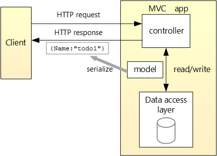
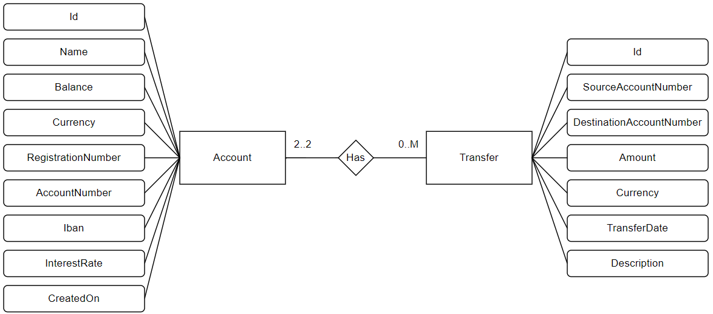

# Account API

This document describes the usage and implementation of the Account API. This API allows users to create a bank account, list accounts, and transfer funds between accounts.

## Prerequisites

To run this application, the following must be installed:
- Visual Studio 2022

## Run Application

To run this application, perform the following steps:
- Clone the repository.
- Navigate to `AccountApi/AccountApi/`.
- Open `AccountApi.sln` with Visual Studio 2022.
- When the project is loaded, hit `Ctrl + F5`.
- Swagger will open automatically in the default browser.

## Usage

### Create Bank Account

- In the Swagger browser window, select **POST /api/Accounts**, and then select **Try it out**.
- Enter a name in the **Name** input field.
- Select **Execute**.

### List Bank Accounts

- In the Swagger browser window, select **GET /api/Accounts**, and then select **Try it out**.
- Select **Execute**.

### Transfer Funds

- In the Swagger browser window, select **POST /api/Transfers**, and then select **Try it out**.
- In the **Request body** input window, update the JSON.
- Select **Execute**.

## Implementation
The Account API is implemented by using ASP.NET Core

### MVC Architecture

The application follows the MVC architecture. The following diagram shows the design of the app:

**Source:** [ASP.NET Core Tutorial: First Web API](https://learn.microsoft.com/en-us/aspnet/core/tutorials/first-web-api?view=aspnetcore-8.0&tabs=visual-studio)

### Data model
The data model is illustrated by the following ER Diagram:

